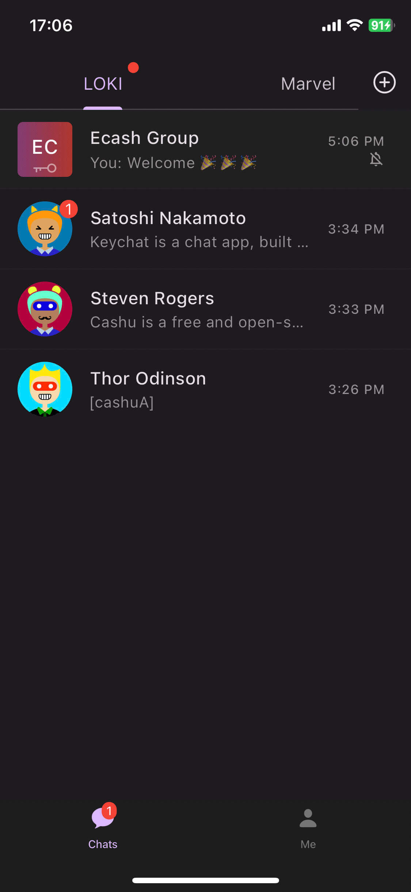
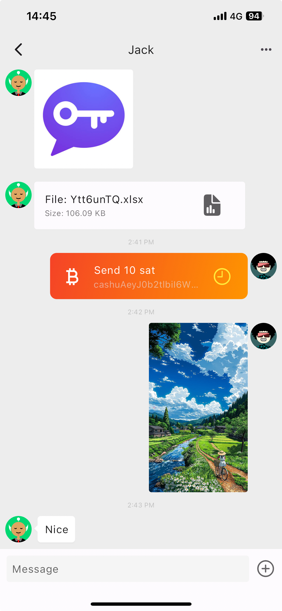
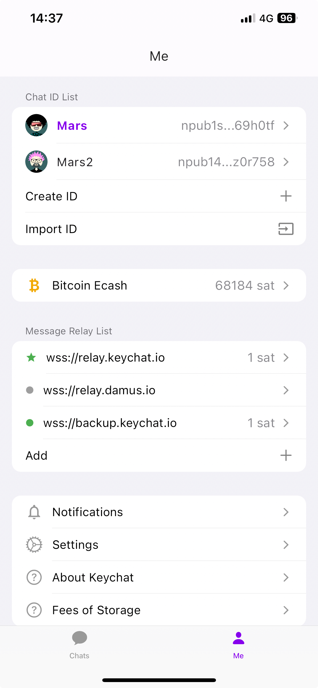
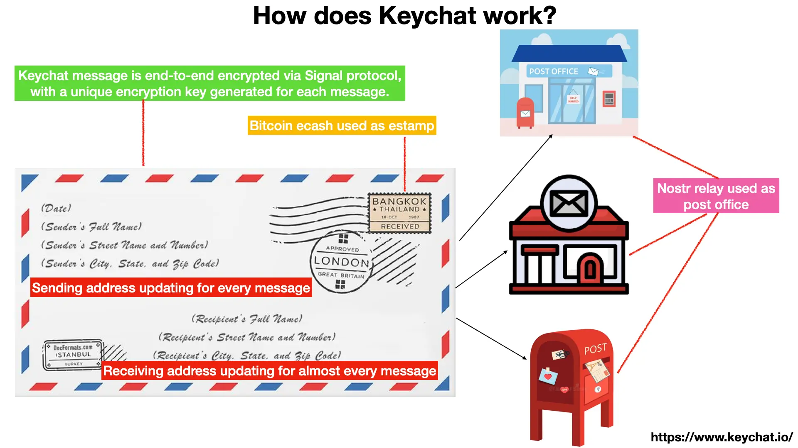

[](https://github.com/invertase/melos)

# Keychat APP

> Keychat is a chat app, built on Bitcoin Ecash, Nostr Protocol and Signal Protocol.

<p>



</p>

## Inspiration

Keychat is inspired by the postal system — stamps, post offices, letters.
Keychat uses Bitcoin ecash as stamps and Nostr relays as post offices.



## About Keychat

- Senders send messages stamped with Bitcoin ecash to Nostr relays. The Nostr relays collect the Bitcoin ecash, then deliver messages to receivers.
- Unlike the centralized postal system, Keychat can use multiple Bitcoin ecash issuers and Nostr relays, each maintained by distinct operators.
- Keychat uses Signal protocol to ensure message encryption security and meta-data privacy.
- The content of the letter can be exposed easily by opening the envelope. Keychat messages are end-to-end encrypted via Signal protocol, with a unique encryption key generated for each message. Only the sender and receiver can decrypt the message.
- The addresses of both parties on the envelope can be tracked. In theory, this problem is solved if they change addresses daily. So Keychat reuses Signal protocol to update sending and receiving addresses for nearly every message.
- Like the postal system, Keychat requires no registration. Users just generate Nostr keys as ID.

## Supported Hardware Platform

- Android
- iOS
- macOS

## Spec Compliance

Keychat implements the following nips:

- [NIP-01: Basic protocol flow][nip01]
- [NIP-04: Encrypted direct message][nip04]
- [NIP-19: bech32-encoded entities][NIP19]
- [NIP-06: Basic key derivation from mnemonic seed phrase][nip06]

[nips]: https://github.com/nostr-protocol/nips
[nip01]: https://github.com/nostr-protocol/nips/blob/master/01.md
[nip04]: https://github.com/nostr-protocol/nips/blob/master/04.md
[nip06]: https://github.com/nostr-protocol/nips/blob/master/06.md
[nip19]: https://github.com/nostr-protocol/nips/blob/master/19.md

## Getting Started

```
git submodule update --recursive

melos bootstrap

cargo install flutter_rust_bridge_codegen@1.82.6
cd packages/keychat_rust/rust
cargo xcode # for ios
cd $project_home_dir

melos run rust:ios # build a rust ffi lib for app

or [melos run rust:macos, melos run rust:android]


cd packages/app
flutter run

# build apk to release
melos run build:android
```

## Git Commit

[Commit Message Conventions](https://gist.github.com/stephenparish/9941e89d80e2bc58a153)

## Based On

- [Nostr Protocol](https://nostr.com/): for delivering and storing messages.
- [Ecash Cashu](https://cashu.space/): for paying micropayments to relays (optional), depends on whether relay charges a fee.
- [Signal Protocol](https://github.com/signalapp/libsignal): for encrypting messages (end-to-end).
- AWS S3: for storing encrypted files.
- [OneSignal](https://onesignal.com): Push Notifications.
- [Isar DB](https://github.com/isar/isar): a NoSQL database for Flutter for local data storage.
- [flutter_rust_bridge](https://github.com/fzyzcjy/flutter_rust_bridge/): Flutter/Dart <-> Rust binding generator, feature-rich, but seamless and simple.
- [melos](https://melos.invertase.dev/): Melos is a CLI tool used to help manage Dart projects with multiple packages
- [rust-nostr](https://github.com/rust-nostr/nostr): Nostr protocol implementation, SDK and FFI

## License

Licensed under the GNU AGPLv3: [https://www.gnu.org/licenses/agpl-3.0.html](https://www.gnu.org/licenses/agpl-3.0.html)
