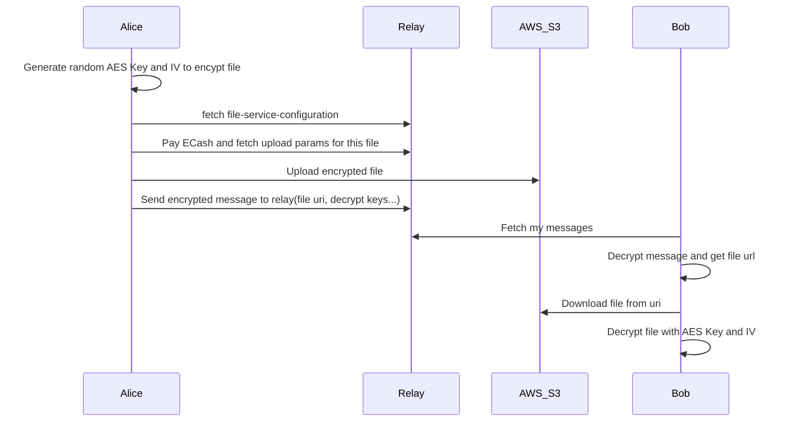

# Encrypt and upload files

## Workflow


1. User uploads files: Users can upload images, videos, and various types of files to Keychat.

2. File Service Configuration: File storage on the relay may be charged or free. If payment is required, pay and then obtain file upload parameters.

3. Encryption and key generation: A one-time secret key is generated and used to encrypt the file using AES-CTR encryption.

4. Upload to AWS S3: After obtaining the necessary upload parameters from the relay (including ECash sat payment if the relay charges for file storage), the encrypted file is uploaded to AWS S3 servers.

5. Sharing file information: The file download path and decryption key are then sent to the recipient.

6. Recipient downloads and decrypts: Upon receiving the message from the relay, the recipient retrieves the file and performs local decryption, saving the decrypted file to their local storage.



## Relay's UploadFileService Info

> relay host: https://relay.keychat.io

Get `/api/v1/info`

### Response

```json
{
  "expired": "14 Days",
  "maxsize": 104857600,
  "mints": ["https://8333.space:3338"],
  "prices": [{ "max": 10485760, "min": 1, "price": 1 }],
  "unit": "sat"
}
```

For files under 10M, each file requires a payment of 1sat.
If the price is 0, It's free to upload files.

## Reuqst Upload Params

Post `/api/v1/object`

- cashu: pay cashu token to relay, if relay charges.
- length: file length. Larger file require more Ecash sat to be paid.
- sha256: file hash

### Response

```json
{
  "method": "PUT",
  "url": "https://s3.keychat.io/s3.keychat.io/xxx?X-Amz-Algorithm=AWS4-HMAC-SHA256&X-Amz-Credential=xx%2F20240705%2Fap-southeast-1%2Fs3%2Faws4_request&X-Amz-Date=20240705T032252Z&X-Amz-Expires=600&X-Amz-SignedHeaders=content-length%3Bhost%3Bx-amz-acl%3Bx-amz-checksum-sha256&X-Amz-Signature=xx",
  "headers": {
    "x-amz-checksum-sha256": "xxxx=",
    "content-length": "132256",
    "x-amz-acl": "public-read"
  },
  "access_url": "https://s3.keychat.io/s3.keychat.io/xx"
}
```

### Upload File To AWS S3

```dart
Map<String, dynamic> headers = uploadParams['headers']!;
headers["Content-Type"] = "multipart/form-data";
Dio().put(endpoint,
  data: Stream.fromIterable(fileBytes.map((e) => [e])),
  options: Options(headers: headers),
);

```

### Send Message to relay

Messages are typically encrypted using the Signal protocol and then send to the relay. This message also includes information such as file type, size, and decryption key.

Example:

`https://s3.keychat.io/s3.keychat.io/EUA17rM85OFBL08b4ZzJm5lLRKx9ohIXwXWtTbQ0j4M?kctype=image&suffix=jpg&key=vnSN9KvGwScwSIuZMtI6jPOso0g61GJV1kh%2FiirHUoM%3D&iv=xza9eIm8CtLEIjFD88rD%2Fw%3D%3D&size=132256`
