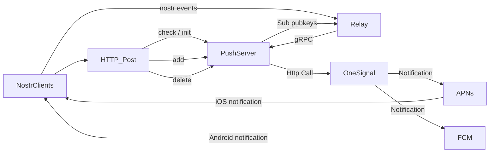

# Push Notifiation

## Abstract

1. Client Registration: Clients register their devices with the notification server (PushServer) by sending their public keys and deviceId.

2. Push Delivery: The PushServer stores the received public keys securely. When a notification needs to be sent, it retrieves the relevant public key(s) associated with the target user(s) and uses [OneSignal] (https://onesignal.com/) to deliver the notification securely to the user's device(s).

## Architecture




## Specification

Send data use Http request to PushServer

## notify server

`https://notify.keychat.io/v2`

### 1. init

- Post `/init`

When app startup, check the hashCode of notification's config from server.
if not equals with local config, call init method.

```json
{
  "kind": 4,
  "deviceId": "<deviceId>",
  "pubkeys": "<list of pubkeys to be notified about. Include: identity pubkey, room pubkey of SharedKeyGroup, ratchet key of private chat>",
  "relays": "<list of relays for the push server to subscribe to>",
  "hash": "hash code of above config"
}
```

calculateHash

```
hash = sha256("[include_pubkeys...,exclude_pubkeys...]");
```

### 2. add

When app running, the signal Double Ratchet will generate a new receivePubkey.
If you joined a new sharedKeyGroup, need to subscribe shared pubkey.

- Post `/add`

```json
{
  "deviceId": "<deviceId>",
  "pubkeys": "<to add pubkeys>",
  "toRemove": "<to remove pubkeys>",
  "relays": "<list of relays for the push server to subscribe to>"
}
```

### 3. remove pubkeys

- Post `/remove`

User turn off notification setting.

```json
{
  "deviceId": "<deviceId>",
  "pubkeys": "<to add pubkeys>"
}
```

### 4. delete all config (turn off notification)

- POST '/delete'

```json
{ "deviceId": "<deviceId>" }
```

### 5. Get hashcode of device configs

- Get `/hashcode?play_id=$play_id`
- play_id: <"deviceId">

## gRPC Call

1. Relay will push all event to PushServer
2. The PushServer checks whether the eventId has been processed.
3. If it has already been processed, it ignores the event.
4. Otherwise, it queries which devices have subscribed to the to address and then calls OneSignal to push notifications.

```
sequenceDiagram
    Alice->>+Relay: Nip4Event(eventId, from, to, content)
    Relay->>+Relay: Server charges then store message
    Relay-->>+NotifyServer: [gRPC] eventId, to
    NotifyServer-->>-Bob: App Notification Push
    Bob-->>Relay: Fetch Nip4Event
```

## Reference

[0xchat notification](https://github.com/0xchat-app/0xchat-core/blob/main/doc/nofitications.md?plain=1)
